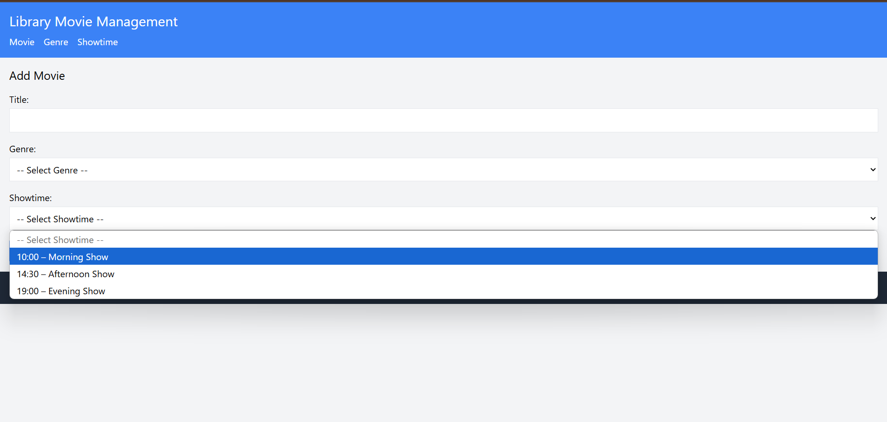
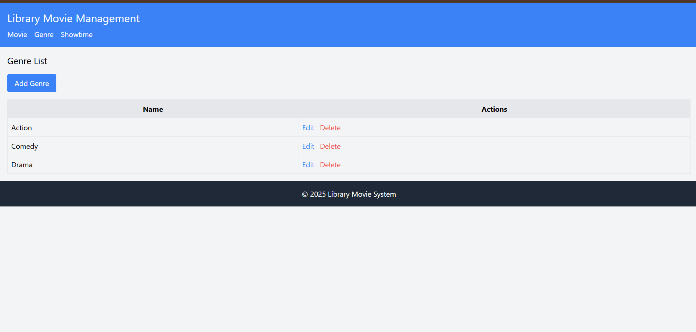
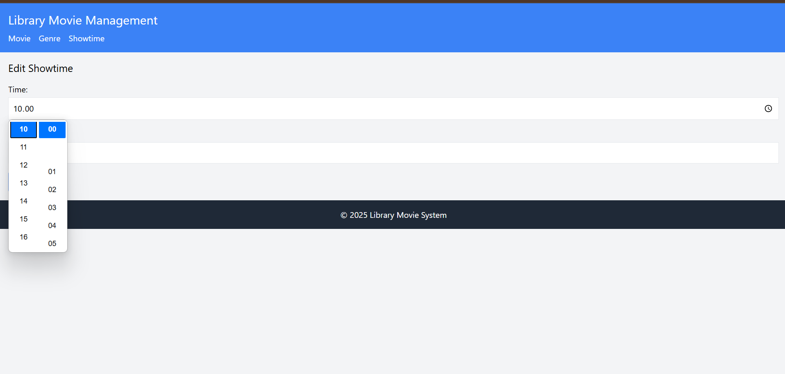

# TP10DPBO2025C2

## Janji
Saya Abdurrahman Al Ghifari mengerjakan evaluasi Tugas Praktikum dalam mata kuliah Desain Pemrograman Berbasis Object untuk keberkahanNya, maka saya tidak melakukan kecurangan seperti yang telah dispesifikasikan. Aamiin.

## Desain Program
Project ini merupakan implementasi sederhana sistem manajemen data cinema berbasis PHP dengan arsitektur MVVM (Model–View–ViewModel) yang memisahkan logika aplikasi menjadi komponen-komponen berikut:

1. **Model**  
   - **config/Database.php**  
     Kelas database wrapper menggunakan MySQLi, mengelola koneksi dan eksekusi query.  
   - **model/Genre.php**, **model/Movie.php**, **model/Showtime.php**  
     Representasi entitas `Genre`, `Movie`, dan `Showtime` beserta atribut serta getter/setter masing-masing.

2. **ViewModel**  
   - **viewmodel/GenreViewModel.php**  
   - **viewmodel/MovieViewModel.php**  
   - **viewmodel/ShowtimeViewModel.php**  
   ViewModel bertanggung jawab menyiapkan dan memproses data dari Model untuk dikonsumsi oleh View, termasuk validasi dan sanitasi.

3. **View**  
   - **views/genre_list.php**, **views/genre_form.php**  
   - **views/movie_list.php**, **views/movie_form.php**  
   - **views/showtime_list.php**, **views/showtime_form.php**  
   File PHP yang bertugas menampilkan antarmuka (HTML + PHP) untuk masing-masing entitas, menerima input pengguna, dan memanggil ViewModel.

4. **Template**  
   - **views/template/header.php**, **views/template/footer.php**  
   Bagian header dan footer yang di-`include` di setiap halaman View untuk konsistensi tampilan.

5. **Database**  
   - **database/cinema.sql**  
     Skrip SQL untuk membuat struktur database (`cinema`) dan tabel `genre`, `movie`, `showtime`, beserta contoh data awal.

6. **Entry Point**  
   - **index.php**  
     Titik masuk aplikasi; memuat autoloader, inisialisasi Database, dan men-dispatch permintaan ke View yang sesuai.

## Alur Program
1. **Permintaan (Request)**  
   Pengguna membuka `index.php` di browser, misalnya `http://localhost/TP_MVVM/index.php?entity=genre&action=list`.

2. **Routing & View**  
   `index.php` membaca parameter `entity` dan `action`, kemudian memanggil file View terkait, misalnya:  
   - `entity=genre&action=list` → memuat **views/genre_list.php**  
   - `entity=movie&action=create` → memuat **views/movie_form.php**  

3. **View → ViewModel**  
   Di dalam setiap View, form submission (method `POST`) diteruskan ke ViewModel:  
   - Jika `$_POST['save_genre']` → `GenreViewModel->create($_POST)`  
   - Jika `$_GET['id_edit_genre']` → `GenreViewModel->getById($id)` → tampilkan form edit  
   - Jika `$_POST['update_genre']` → `GenreViewModel->update($_POST)`  
   - Jika `$_GET['id_delete_genre']` → `GenreViewModel->delete($id)`  

4. **ViewModel → Model/Database**  
   ViewModel memvalidasi dan menyiapkan data, lalu memanggil method pada Model (misalnya `Genre::insert()`, `Genre::findAll()`, `Genre::update()`, `Genre::delete()`), yang pada gilirannya menggunakan koneksi dari `config/Database.php` untuk menjalankan query SQL.

5. **Pengembalian Data & Render**  
   Hasil operasi (success/failure atau daftar data) dikembalikan dari ViewModel ke View, yang kemudian merender HTML akhir dan menampilkan notifikasi atau data tabel kepada pengguna.

6. **Tampilan (Response)**  
   Browser menerima halaman HTML dinamis dengan daftar entitas, form tambah/edit, serta link aksi (Edit/Delete) sesuai with design pattern MVVM.

## Dokumentasi Sistem

### 1. Create  
> __

### 2. Read  
> __

### 3. Update  
> __

#### Video Prov
> __